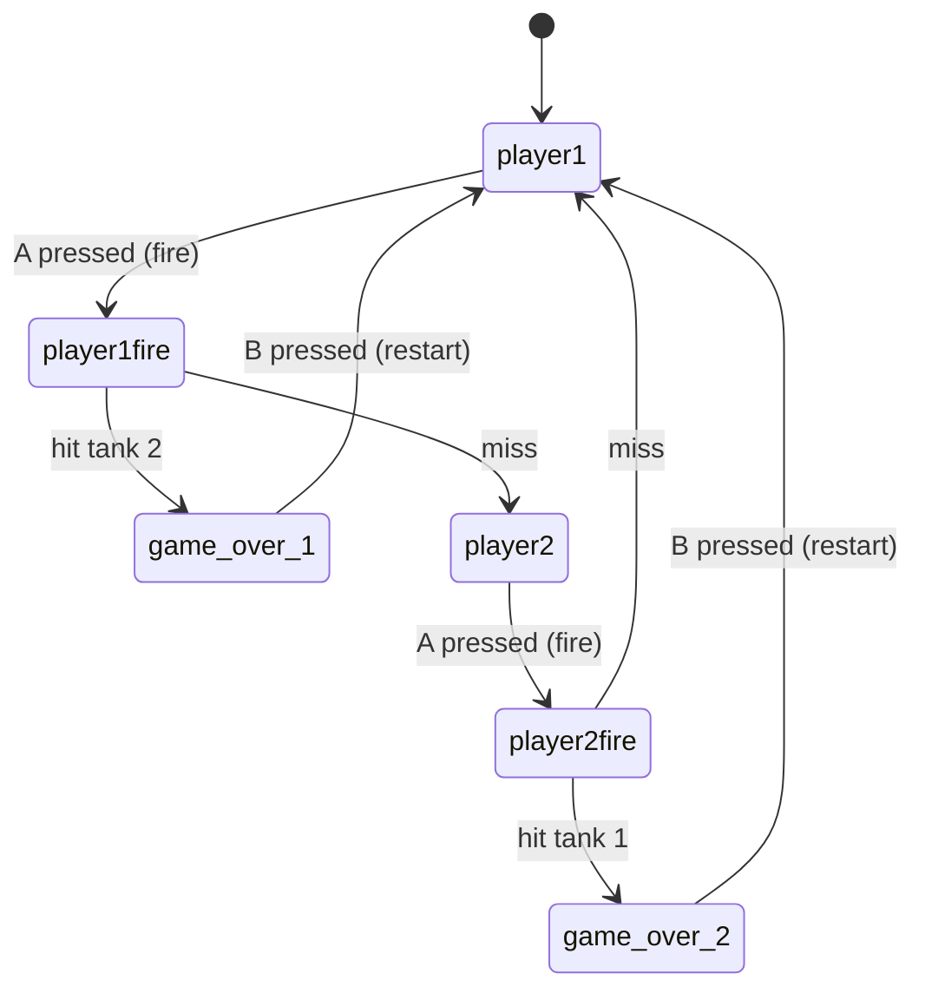

# Tank Game

A two-player artillery game ("Scorched Earth" style) for the **Raspberry Pi Pico**
with the [Pimoroni Pico Display Pack](https://shop.pimoroni.com/products/pico-display-pack?variant=32368664215635),
written in MicroPython.

Players take turns adjusting their tank's gun angle and power, then fire a shell
across randomly generated terrain to try to hit the opposing tank.

## Hardware

| Component | Details |
|---|---|
| Board | Raspberry Pi Pico (or Pico 2) |
| Display | Pimoroni Display Pack, 240×135, PicoGraphics `PEN_RGB565` |
| Buttons | A/B/X/Y on GPIO 12–15 (`PULL_UP`, active low) |
| LED | Onboard RGB LED on GPIO 6/7/8 (turn indicator) |

## Controls

| Button | Action |
|---|---|
| **A** | Fire the shell |
| **B** | Toggle between ANGLE and POWER adjustment mode; restart after game over |
| **X** | Increase angle/power by 5 |
| **Y** | Decrease angle/power by 5 |

- Gun angle range: **0–85°** (relative to horizontal)
- Gun power range: **10–100%**
- Angle and power are **randomized each round** (angle 0–60°, power 25–50%) for extra challenge.
- The active adjustment mode (PWR or ANG) is highlighted in white at the top of the screen.
- The onboard LED glows **blue** on Player 1's turn and **red** on Player 2's turn.

## Files

| File | Responsibility |
|---|---|
| `main.py` | Hardware setup, `Game` class (state machine, input handling, UI drawing, hit detection), entry point |
| `tank.py` | `Tank` — position, gun angle/power, pixel-art tank drawing, gun barrel vector math |
| `shell.py` | `Shell` — projectile ballistics and drawing |
| `terrain.py` | `Terrain` — random terrain generation and fast span-based drawing |

## Game flow

The `Game.run()` loop is a simple state machine:



States: `player1`, `player1fire`, `player2`, `player2fire`, `game_over_1`, `game_over_2`.

## Game mechanics

### Hit detection (`Game.detect_hit`)

Return codes:

| Code | Meaning |
|---|---|
| `0` | Shell still in flight |
| `1` | Shell above the screen (still flying, not drawn) |
| `10` | Miss — shell left the screen (sides, far above, or below) |
| `11` | Miss — shell hit the ground |
| `20` | Hit — shell struck the enemy tank's bounding box |

Each tank exposes a 24×14 px bounding rectangle (`Tank.get_rect()`) for collision checks.

### Ballistics (`shell.py`)

The shell follows a parametric trajectory from the gun muzzle:

- `GRAVITY = 0.008`
- `DISTANCE_SCALE = 1.5` (horizontal stretch)
- `TIME_STEP = 4` (time advance per frame)
- Power is scaled by `/ 40` when fired.
- The right-hand tank mirrors the horizontal velocity via `π − angle`;
  the vertical component always uses the raw angle.

Position at time *t*:

```
x = x0 + vx · t · DISTANCE_SCALE
y = y0 − (vy · t − ½ · GRAVITY · t²)
```

### Terrain generation (`terrain.py`)

- Terrain is built in chunks of `TERRAIN_CHUNK_SIZE = 20` px with a random height
  change of up to ±`TERRAIN_MAX_CHG = 20` px per chunk, linearly interpolated
  for smooth slopes.
- Height is clamped between `TERRAIN_MIN_Y = 50` and the screen bottom.
- Each tank gets a flat platform of `TERRAIN_TANK_SIZE = 20` px at a random x
  position (left tank on the left half, right tank on the right half).
- `is_ground(x, y)` provides per-column ground collision lookup.

### Rendering

The screen is fully redrawn every frame (`FRAME_DELAY = 0.02` s):

1. Sky — a vertical blue gradient.
2. Terrain — green filled rectangles.
3. Both tanks — pixel-span tracks, rectangle hull, and a vector-drawn gun barrel.
4. Shell — a 2×2 white rectangle (only during fire states).
5. UI — active player name (in the player's color), PWR/ANG readout, game-over text.

## Performance optimizations

Written for the Pico's limited CPU, the code includes several optimizations:

- **Precomputed sky gradient pens** — one pen per screen row is created once at
  startup instead of every frame (pen creation is expensive on the Pico).
- **Terrain run-length spans** — adjacent columns with the same ground height are
  collapsed into `(x_start, x_end, y)` spans at setup time, so `Terrain.draw()`
  emits a handful of rectangles instead of one line per column.
- **Hoisted tank selection** in `Game.key_pressed()` — the active tank is chosen
  once per call rather than in every button branch.

## Building and deploying

The easiest way is the included deploy script (requires `mpremote`:
`python3 -m pip install --user mpremote`):

```bash
./deploy.sh              # test, deploy, then run with console output (Ctrl-C to detach)
./deploy.sh --no-run     # test and deploy only; game auto-starts after reset/power-up
./deploy.sh --no-test    # skip the host-side smoke test
./deploy.sh --device /dev/cu.usbmodem1101   # explicit serial device
```

The script:

1. Syntax-checks all source files (`py_compile`)
2. Runs the host-side smoke test (`.smoke_test.py`, stubbed hardware — no Pico needed)
3. Auto-detects the Pico serial device (`/dev/cu.usbmodem*` on macOS, `/dev/ttyACM*` on Linux)
4. Frees the port if a previous session is holding it
5. Copies `main.py`, `tank.py`, `shell.py`, and `terrain.py` to the Pico
6. Runs the game (or resets the Pico with `--no-run` so `main.py` auto-starts)

Manual alternative: copy the four `.py` files with Thonny or `mpremote`. The game
starts automatically on boot since the entry point is `main.py`. Requires MicroPython
firmware with the Pimoroni `picographics` and `pimoroni` modules (use the
[Pimoroni MicroPython build](https://github.com/pimoroni/pimoroni-pico/releases)).
